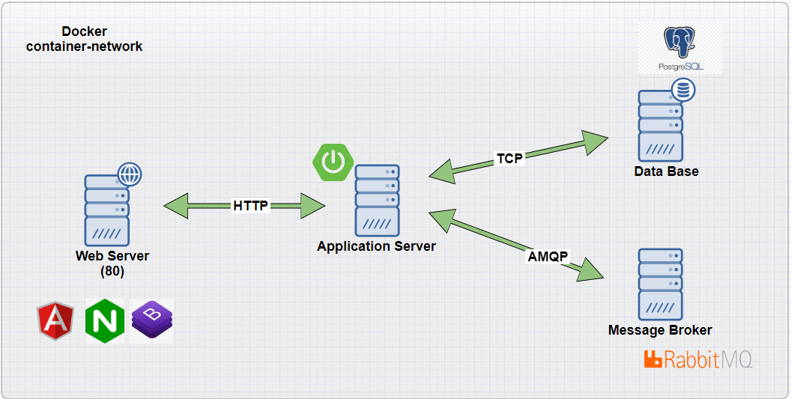
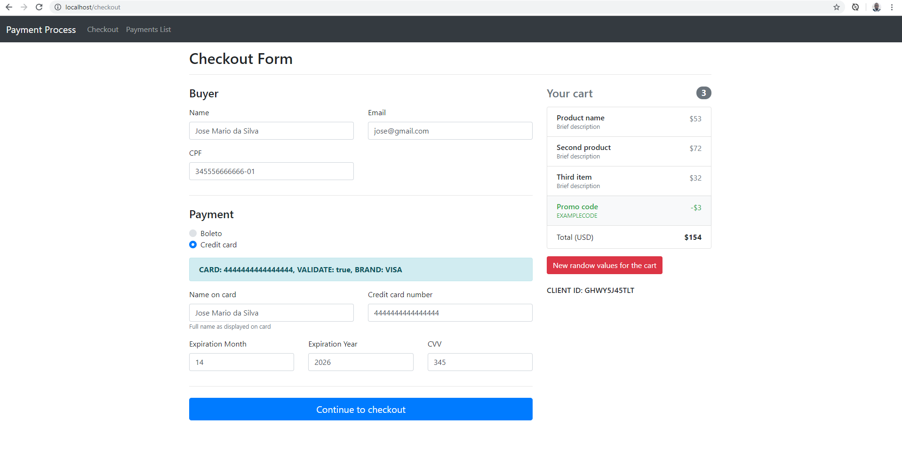
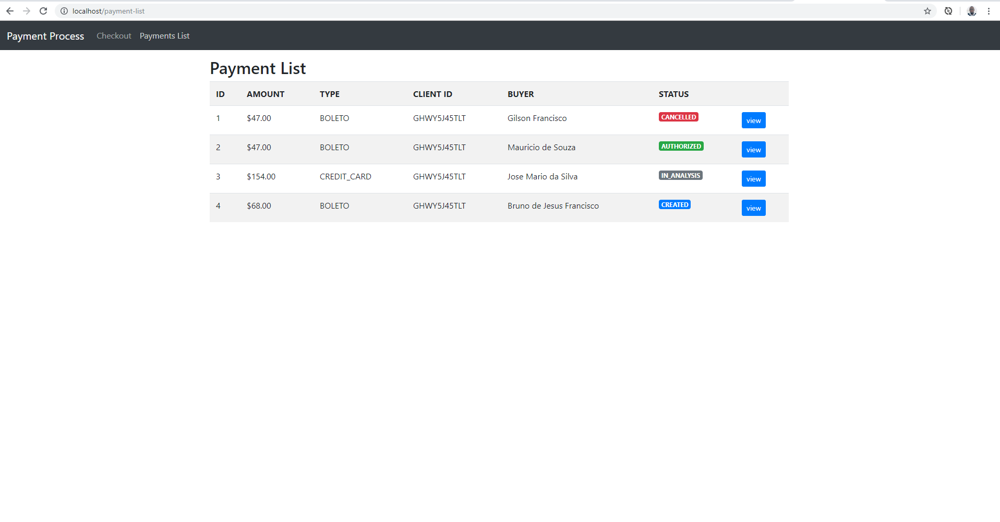
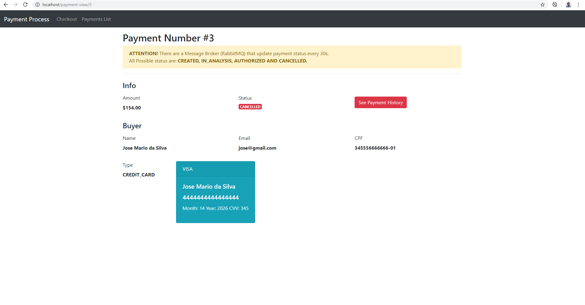
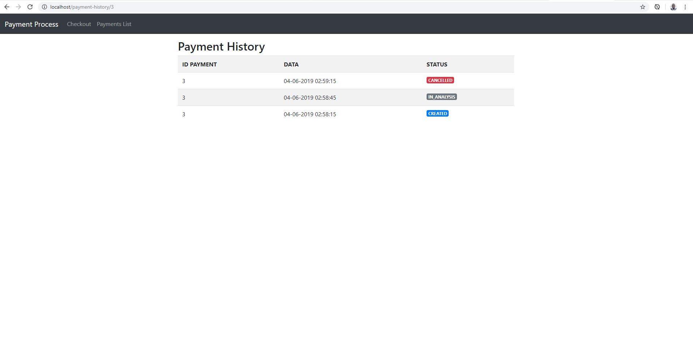
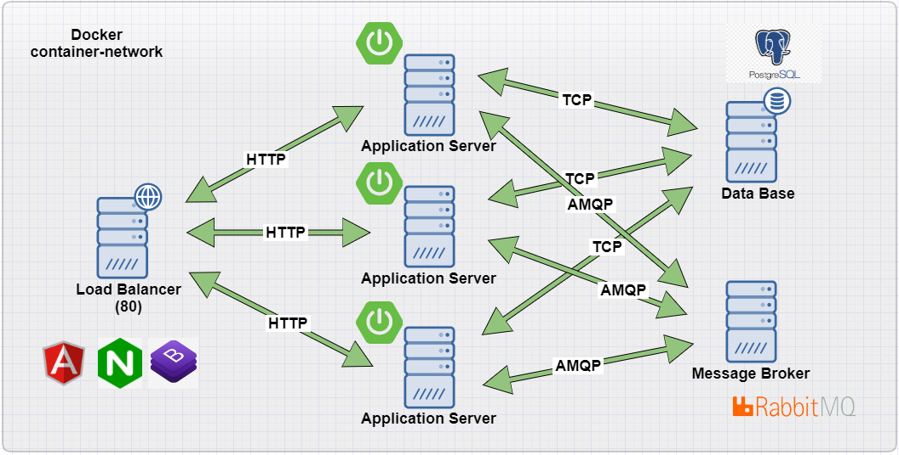

# Payment Process

This is a Simple End-To Application which uses Angular 7 and Bootstrap 4 as Front End running behind NGINX, Spring Boot 1.5.9 generated from Swagger to provide REST APIS to the front end, PostgreSQL as Data Base and RabbitMQ as a Message Broker. All these components is running inside docker containers.
<br>
JUnit + Mockito was used for testing and Maven to manage project's build and dependencies.
<br>
The purpose of this application is simulate an API for payment and a checkout form.
<br>
To help validate a card we use wirecardBrasil/credit-card-validator component.

## Architecture Overview



## How-to

### Requirements

Install <b>Docker</b>: https://docs.docker.com/engine/installation/

Install <b>docker-compose</b>: https://docs.docker.com/compose/install/

### Installation

Run the following commands:
  
```
$ git clone https://github.com/gilsonsf/payment-process.git
$ cd payment-process
$ sudo docker-compose up
```

### Accesses

Application http://localhost/ 

Swagger API http://localhost:8080/payment-process-api/v1

HabbitMQ http://localhost:15672/ user:guest password:guest

### Screenshots

Checkout Screen 

List Payment Screen 

View Payment Screen 

History Payment Screen 

## (Plus) Load Balancer Architecture Overview:



### Installation Load Balancer

**WARNING**: In this POC, application is responsable for creating the database.
In this scenario where more than one application is installed at the same time to attend a larger number of requests, there is cuncurrency between them, which may result in some errors when creating the database.
If any container not running and resulting a error like: **exited code 1**, please stop docker **Ctrl + C** and running: **docker-compose up** again.
It will probably work.


Run the following commands:
  
```
$ git clone https://github.com/gilsonsf/payment-process.git
$ cd payment-process/docker-load-balancer
$ sudo docker-compose up
```

### Technologies

- [wirecardBrasil/credit-card-validator](https://github.com/wirecardBrasil/credit-card-validator)

- [Swagger](https://swagger.io/)

- [Spring Boot](https://spring.io/projects/spring-boot)

- [Docker](https://www.docker.com/)

- [Nginx](https://www.nginx.com/)

- [PostgresSQL](https://www.postgresql.org/)

- [RabbitMQ](https://www.rabbitmq.com/)

- [Angular](https://angular.io/)

- [Bootstrap 4](https://getbootstrap.com.br/docs/4.1/getting-started/introduction/)

- [Java](www.java.com)

- [Maven](https://maven.apache.org/)

- [JUnit](https://junit.org/)

- [Mockito](https://site.mockito.org/)


